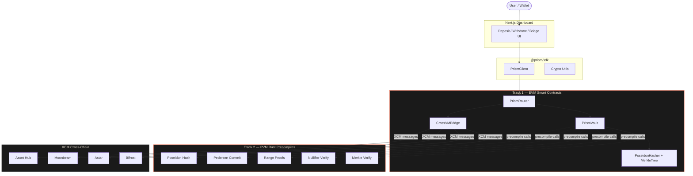

# Prism Protocol

**Cross-VM Privacy-Preserving DeFi Router for Polkadot Hub**

[](https://soliditylang.org/)
[](https://www.rust-lang.org/)
[]()
[]()
[](./LICENSE)

Prism is a privacy layer for Polkadot Hub that makes DeFi transactions unlinkable. It uses commitment schemes and nullifier proofs to break the on-chain connection between depositors and recipients. Heavy cryptography (Poseidon hashing, Pedersen commitments, range proofs) runs on PVM via Rust precompiles compiled to RISC-V — **14x cheaper** than equivalent Solidity. XCM integration extends privacy across parachains.

**[Live Dashboard](https://prism-sigma-ten.vercel.app)** | **[Demo Video](#)** | **Polkadot Solidity Hackathon 2026**

---

## Architecture



## Hackathon Tracks

| Track | What we built |
|-------|--------------|
| **Track 1: EVM** | 3 Solidity contracts (PrismVault, PrismRouter, CrossVMBridge) + 2 libraries (PoseidonHasher, MerkleTree) |
| **Track 2: PVM** | 5 Rust precompile modules compiled to RISC-V for PolkaVM (Poseidon, Pedersen, Merkle, Nullifier, Range Proof) |
| **XCM** | Privacy-preserving cross-chain transfers to Asset Hub, Moonbeam, Astar, Bifrost |

## Tech Stack

| Layer | Technology | Package |
|-------|-----------|---------|
| Frontend | Next.js 15, React 19, Tailwind CSS, ethers.js 6 | `packages/dashboard` |
| Contracts | Solidity 0.8.24, Hardhat, OpenZeppelin 5 | `packages/contracts` |
| PVM Precompiles | Rust, Arkworks (BN254), SHA3 | `packages/pvm` |
| SDK | TypeScript, ethers.js 6, Vitest | `packages/sdk` |

## Key Features

- **Private deposits & withdrawals** — Fixed-denomination vaults with Poseidon commitments. Deposits are indistinguishable; withdrawals use nullifier proofs with no link to the depositor.
- **PVM-accelerated cryptography** — Poseidon hashing, Pedersen commitments, and range proofs run as native Rust precompiles on PolkaVM. ~14x gas savings vs. Solidity.
- **Multi-vault routing** — PrismRouter manages vaults across tokens and denominations (0.1, 1, 10, 100). Greedy algorithm splits arbitrary amounts into optimal deposits.
- **Cross-VM bridging** — Lock commitments on EVM, release on PVM (or vice versa). Privacy maintained across virtual machines.
- **XCM cross-chain transfers** — Send shielded commitments to connected parachains via XCM messages. Recipients claim with the note on the destination chain.
- **TypeScript SDK** — Full client library with commitment generation, note encoding/decoding, proof generation, and contract interaction.

## Project Structure

```
prism/
├── packages/
│   ├── dashboard/          # Next.js 15 frontend
│   │   ├── app/            # Pages and layout
│   │   ├── components/     # Deposit, Withdraw, Bridge, Stats, Architecture
│   │   ├── lib/            # Wallet connection, contract config
│   │   └── e2e/            # 16 Playwright tests
│   ├── contracts/          # Solidity smart contracts
│   │   ├── contracts/      # PrismVault, PrismRouter, CrossVMBridge, libraries
│   │   ├── test/           # 28 Hardhat tests
│   │   └── scripts/        # Deploy and verify scripts
│   ├── sdk/                # TypeScript client library
│   │   └── src/            # PrismClient, crypto utils, ABIs
│   └── pvm/                # Rust PVM precompiles
│       └── src/            # Poseidon, Pedersen, Merkle, Nullifier, Range Proof
├── turbo.json              # Turborepo build orchestration
├── vercel.json             # Deployment config
└── DEMO_SCRIPT.md          # Demo video recording guide
```

## Getting Started

```bash
# Install dependencies
pnpm install

# Compile smart contracts
pnpm compile

# Run all tests (contracts + SDK + E2E)
pnpm test

# Start the dashboard locally
pnpm --filter dashboard dev
```

## Deployed Contracts (Paseo Testnet)

| Contract | Address |
|----------|---------|
| PVMCryptoCore | `0x4869DFe4ecefC84DfE431D50eCDab523D426C726` |
| MockUSDC | `0xd2D887b18a67966aCD28265a506C68210A01c74E` |
| PrismVault | `0x9D8bCBE10aDc3D76D7064d8a560b3a519a3CABa5` |
| PrismRouter | `0xcCB6b954C612AF1b432C13B7C506a40B31834F49` |
| CrossVMBridge | `0x7Cf119198c6Ee09621F362f863cd9E8a44f450f3` |

**Network:** Polkadot Hub Paseo Testnet
**Chain ID:** `420420417` (0x190F1B41)
**RPC:** `https://services.polkadothub-rpc.com/testnet`

## How It Works

```
1. DEPOSIT
   User deposits tokens with a fixed denomination (e.g., 1 DOT).
   SDK generates a random secret and computes:
     nullifier = Poseidon(secret, 0)
     commitment = Poseidon(secret, nullifier)
   The commitment is inserted into an on-chain Merkle tree.
   User receives a "note" (hex-encoded secret + metadata).

2. PVM ACCELERATION
   Poseidon hashing, Pedersen commitments, and range proofs
   are computed by Rust precompiles on PolkaVM — not in Solidity.
   This cuts gas costs by ~14x for cryptographic operations.

3. WITHDRAW
   User provides the note to a different address.
   SDK reconstructs the Merkle proof and computes the nullifier hash.
   The contract verifies the proof and checks the nullifier hasn't been spent.
   Funds are released. No on-chain link between deposit and withdrawal addresses.

4. CROSS-CHAIN (XCM)
   Commitments can be sent to connected parachains via XCM messages.
   The recipient claims on the destination chain with the note.
   Privacy is maintained — identities never travel with the commitment.
```

## Tests

| Package | Framework | Tests |
|---------|-----------|-------|
| Contracts | Hardhat + Chai | 28 |
| SDK | Vitest | 19 |
| PVM | Cargo test | 26 |
| Dashboard | Playwright E2E | 16 |
| **Total** | | **89** |

```bash
# Run everything
pnpm test

# Run specific packages
pnpm --filter contracts test    # Solidity tests
pnpm --filter sdk test          # SDK unit tests
pnpm --filter dashboard test    # Playwright E2E
cd packages/pvm && cargo test   # Rust tests
```

## License

[MIT](./LICENSE)
