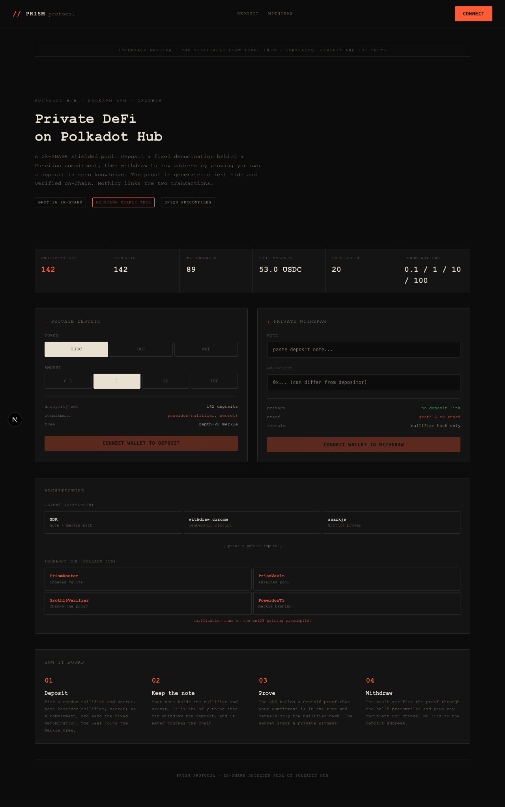

# Prism

A zk-SNARK shielded pool for Polkadot Hub. Deposit a fixed amount behind a commitment, then withdraw to a fresh address by proving you own a deposit in zero knowledge. Nothing on-chain links the deposit to the withdrawal.



## What this proves

Real privacy on Polkadot's new PolkaVM-based EVM is the hard part, and here it works end to end:

- A **Groth16 zero-knowledge proof** is generated in the client and verified **on-chain**. The user's secret is a private witness and never appears in a transaction.
- The proof is verified through the **bn128 pairing precompiles** (`0x06`/`0x07`/`0x08`), which the Polkadot Hub contracts runtime (`pallet-revive` / PolkaVM) actually implements. Confirming that, and compiling a real Groth16 verifier with the `revive` toolchain, is most of the work.
- One **Poseidon hash** is shared across three layers that must agree exactly: the circom circuit, the on-chain Solidity Merkle tree, and the TypeScript SDK. A test asserts the on-chain hash equals the off-chain hash, and the on-chain Merkle root equals the SDK-rebuilt root.

This is a focused build: a single-denomination shielded pool, on testnet, with a self-contained trusted setup. It is not audited and not for mainnet (see [Security](#security)).

## How it works

The design follows the commitment / nullifier pattern (Tornado Cash style), modernized to Poseidon + Groth16.

1. **Deposit.** The depositor picks a random `nullifier` and `secret`, computes `commitment = Poseidon(nullifier, secret)`, and sends it with the fixed denomination. The commitment is inserted as a leaf in an on-chain incremental Merkle tree.
2. **Note.** The `(nullifier, secret)` pair is the note. It is the only thing that can spend the deposit and it never leaves the client.
3. **Prove.** To withdraw, the client builds a Groth16 proof over `withdraw.circom` showing that:
   - it knows a `(nullifier, secret)` whose `commitment` is a leaf of the tree at a known `root`, and
   - the revealed `nullifierHash = Poseidon(nullifier)` matches that note.

   The `recipient` address is bound into the proof so a relayer cannot redirect it.
4. **Withdraw.** The vault checks the `root` is recent, the `nullifierHash` is unused, and the proof verifies. It then pays the recipient and marks the nullifier spent. The only public outputs are the root, the nullifier hash, and the recipient. The link to the original deposit is never revealed.

## Architecture

```
client (off-chain)                         Polkadot Hub (PolkaVM EVM)
-----------------------                    --------------------------------
@prism/sdk                                 PrismRouter   indexes vaults by
  note + Poseidon Merkle path                            (token, denomination)
  snarkjs Groth16 prover  --- proof --->   PrismVault    shielded pool + tree
                              + public      Groth16Verifier  checks the proof via
                                inputs                       the bn128 precompiles
withdraw.circom (circom 2)                 PoseidonT3    circomlib-compatible hash
```

- **`packages/circuits`** - the `withdraw.circom` membership circuit and a self-contained Groth16 setup that emits the proving key, verification key, and `Verifier.sol`.
- **`packages/contracts`** - `PrismVault` (the pool + incremental Merkle tree), `PrismRouter` (indexes vaults by token and denomination), the generated `Groth16Verifier`, and the adopted `PoseidonT3` library.
- **`packages/sdk`** - TypeScript client: note creation, off-chain Merkle tree reconstruction from events, and proof generation via snarkjs.
- **`packages/dashboard`** - a Next.js interface for the protocol.

### On PolkaVM

Polkadot Hub runs contracts on PolkaVM (RISC-V) through `pallet-revive`; Solidity is compiled to PolkaVM with the `revive` (`resolc`) toolchain rather than to EVM bytecode. The thing that makes an in-contract zk verifier viable is that `pallet-revive` ships the full Ethereum precompile set, including the BN254 `Bn128Add`, `Bn128Mul`, and `Bn128Pairing` ops a Groth16 verifier calls. The `PoseidonT3` hash is kept as Solidity source (not pre-compiled EVM bytecode) for the same reason: it has to be compiled by `resolc` to run on PolkaVM.

## Tech stack

- Solidity ^0.8.24, Hardhat, OpenZeppelin
- circom 2, snarkjs (Groth16 over BN254)
- circomlib / `poseidon-solidity` (Poseidon t=3)
- TypeScript, ethers v6
- Next.js, Playwright
- pnpm workspaces, Turborepo

## Running it

```bash
pnpm install

# 1. Build the circuit + run a local Groth16 setup (emits Verifier.sol, wasm, zkey)
pnpm --filter @prism/circuits build

# 2. Build the SDK and compile contracts
pnpm --filter @prism/sdk build
pnpm --filter @prism/contracts compile

# 3. Run the tests
pnpm --filter @prism/contracts test     # contracts + full real-zk withdraw E2E
pnpm --filter @prism/sdk test            # crypto + Merkle tree
pnpm --filter @prism/dashboard test:e2e  # dashboard (Playwright)

# 4. Deploy (local node, or Polkadot Hub via PRIVATE_KEY + POLKADOT_HUB_RPC)
pnpm --filter @prism/contracts deploy

# 5. Run the dashboard
pnpm --filter @prism/dashboard dev
```

The committed `wasm` / `zkey` / verification key let you generate and verify proofs without re-running the setup. Re-running `@prism/circuits build` performs a fresh trusted setup and regenerates `Verifier.sol`; redeploy the verifier if you do.

## What is verified

- **Contracts (28 checks + E2E):** deposit, Merkle root advance, router registration and routing, denomination split, validation reverts, and a full deposit then real Groth16 proof then on-chain withdraw, including double-spend rejection and recipient re-targeting rejection.
- **Poseidon consistency:** a test asserts the on-chain `PoseidonT3` output equals the circuit/SDK Poseidon, and the on-chain Merkle root equals the SDK-rebuilt root.
- **SDK:** Poseidon determinism, note round-trip, Merkle path reconstruction.
- **Dashboard:** Playwright UI checks.

On-chain behavior is verified on the local Hardhat network, which provides the same bn128 precompiles. Live Polkadot Hub deployment relies on those precompiles being present in the deployed runtime; a quick sanity check is to `eth_call` the `0x08` precompile with the standard EIP-197 pairing vector and confirm it returns `1`.

## Security

This is a testnet / educational build, not audited, not for mainnet.

- The trusted setup runs locally with a single contributor, so the toxic waste is not guaranteed destroyed. A production deployment requires a multi-party ceremony.
- Fixed denominations per vault are what create the anonymity set; mixing denominations leaks information.
- Withdrawing yourself links your funding address to the transaction via gas. A relayer (out of scope here) is needed for full unlinkability.

## License

MIT. See [LICENSE](LICENSE).
